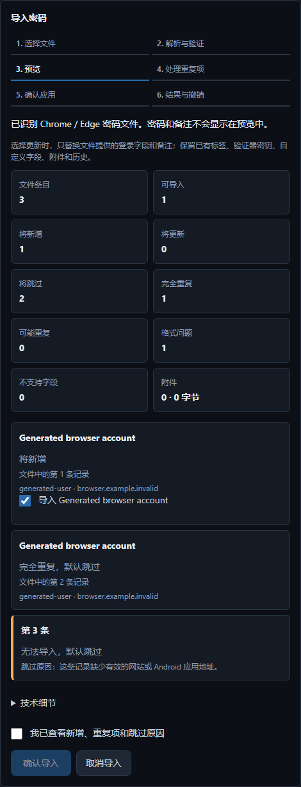

# Import passwords from Chrome or Edge

This source feature is under development after v1.3.0. It is not included in the
published v1.3.0 installer.



In **Passwords → Import from browser**, choose Chrome or Edge, follow the export
instructions, and select the original CSV file. The same importer remains
available in **Security & recovery → Import passwords**, where automatic format
detection also accepts Vault Unified JSON and CSV transfers.

Preview shows account names, usernames, website hosts and record numbers, never
passwords or notes. New accounts are selected by default and can be unchecked.
Identical accounts are skipped. Possible duplicates default to Skip; choosing an
existing account explicitly updates only fields actually supplied by the browser
file. Tags, TOTP keys, custom fields, attachments, connected-source identifiers and
history are retained. Missing name/note columns do not erase the corresponding
existing values. A supplied empty note explicitly replaces the existing note.

Review the counts and any duplicate choices, check the confirmation box, then
select **Confirm import**. The existing atomic import, pre-import backup, stale
preview rejection and same-session undo apply. Cancel writes nothing. Imported
passwords stay local until a separate sync operation is reviewed.

After checking the imported accounts, delete the plaintext browser export. The
app neither deletes the export nor changes passwords stored in the browser.

## Accepted files and errors

- UTF-8 CSV, optionally with a byte-order mark, up to 10 MiB and 5,000 records.
- Required columns: `url`, `username`, `password`. Optional: `name` and `note`
  (or `notes`). Column order may vary. Header capitalization and surrounding
  whitespace are ignored; password and username contents are preserved exactly.
- Browser exports containing Android app credentials are preserved as login
  entries. Import does not add Android app autofill support.
- Quoted commas, quotation marks and multiline notes/passwords are handled by
  the CSV parser. Do not open and re-save the export in spreadsheet software.
- Missing or extra cells, an empty password or an invalid address marks that
  record invalid. Its fields remain hidden in the preview to avoid exposing
  values shifted into the wrong column.
- Duplicate headers, unknown/ambiguous columns, broken CSV quoting and an
  unsupported encoding reject the file without a write. Re-export from the
  browser rather than guessing how columns should map.
- Two visually identical passwords with different Unicode sequences remain
  distinct passwords when detecting duplicates.

Chrome and Edge use overlapping CSV schemas, so detection identifies a
Chrome/Edge-compatible file rather than claiming to identify which browser
created it. Direct extraction from a browser's private credential database and
passkey transfer are not part of this CSV workflow.

## Sources and verification

The format and help text were checked on 2026-10-04 against
[Chromium's CSV writer](https://github.com/chromium/chromium/blob/main/components/password_manager/core/browser/export/password_csv_writer.cc),
[Chrome export help](https://support.google.com/chrome/answer/13068232?hl=en), and
[Edge export help](https://support.microsoft.com/en-us/edge/export-passwords-in-microsoft-edge).

`tests/test_import_flow.py` exercises actual API and encrypted-vault behavior.
`apps/desktop/tests/ui/browser-import.spec.ts` runs the renderer against an
isolated real API, substituting only the Tauri runtime-configuration handoff;
it does not simulate import parsing or saving. It is not a packaged-native-app
or real-user acceptance test. Only generated credentials are used, retained
network traces are disabled, and explicit preview screenshots are marker-scanned.

Run the focused checks from the repository root:

```powershell
.\.venv\Scripts\python -m pytest tests/test_import_flow.py -q
pwsh -NoProfile -File scripts/run-ui-journeys.ps1 -TestFiles browser-import.spec.ts
```

Rolling back this feature does not require a vault migration. Imported entries
use the existing encrypted entry format; older clients can read them. Reverting
the source removes browser-format recognition and the new UI, not saved entries.
