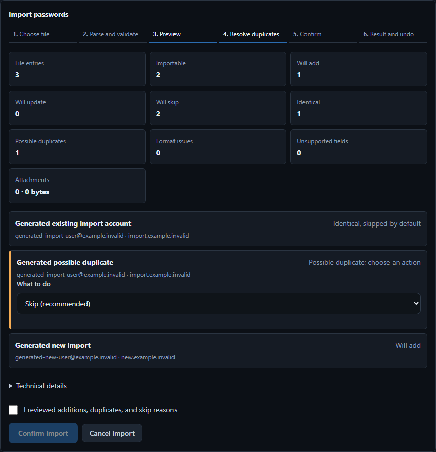

# Import preview, duplicate handling, and undo

This document defines the v1.3 import safety contract. Import is a local-only,
preview-first operation. It never contacts a connected password manager and it
does not bypass the normal sync preview.

The screenshot uses generated `.invalid` accounts and contains no password,
TOTP secret, note, attachment content, token, or real user data.

## Six-step flow

1. Choose one JSON or CSV file.
2. Parse and validate the complete file in memory.
3. Review every importable, duplicate, and invalid item.
4. Resolve possible duplicates explicitly.
5. Confirm the exact plan and apply it once.
6. Review the receipt or undo while the vault still matches the post-import state.

Preview and cancel perform zero vault writes. The plaintext file content is not
written to browser storage, logs, receipts, screenshots, or metadata. The
backend retains validated entries only in an in-memory, five-minute preview
bound to the current unlocked session. Locking clears that session state.

## Deterministic duplicate rules

Text comparison uses Unicode normalization. Titles and usernames are trimmed,
internal whitespace is collapsed, and comparison is case-insensitive. Website
matching uses a lower-case IDNA hostname. A URL path is not used for a possible
duplicate match.

An **identical entry** has the same normalized title and username and the same:

- password, with case and whitespace preserved;
- URL scheme/hostname plus case-sensitive path, query, and fragment;
- notes, with case and whitespace preserved apart from line-ending normalization;
- normalized tag set and entry type;
- custom-field labels, exact values, and concealed flags;
- normalized TOTP secret; and
- attachment filename/type/size/content hashes.

The comparison is performed with a backend SHA-256 fingerprint. The fingerprint
and its secret inputs are never returned to the renderer. Identical entries are
skipped and cannot be changed into an update from the import UI.

A **possible duplicate** matches either:

- normalized website hostname plus normalized username; or
- normalized title plus normalized username.

Possible duplicates default to **Skip**. The user can instead import a separate
new entry or choose one of the exact previewed entry IDs to update. Title alone
never authorizes an overwrite.

An invalid or ambiguous row defaults to **Skip** and includes a reason without
echoing field values. Unsupported fields are named and counted; their values are
not returned. A malformed JSON document or unsupported transfer schema rejects
the entire preview. A malformed field in one valid CSV row marks that row invalid
while allowing the other rows to remain visible.

## Atomic apply

The preview token is single-use and bound to the session, the complete logical
vault digest, and an in-process generation. Apply refuses a stale preview. The
server revalidates every decision, creates a verified encrypted pre-import
backup, stages all additions and updates, and performs one encrypted atomic vault
write. An update preserves the entry ID, connected-source identifiers, and an
encrypted history snapshot. No automatic push runs after import.

If the encrypted write fails, the active vault bytes and in-memory entries remain
unchanged. A verified pre-import backup may remain, and the error says so. Retrying
the same preview token cannot repeat the batch.

## Receipt and undo

The in-memory receipt contains only:

- transaction ID;
- source file SHA-256;
- before and after logical vault digests and generations;
- added and updated entry IDs; and
- timestamp and undo status.

It never contains passwords, notes, TOTP secrets, custom-field values, attachment
content, or tokens. Undo is available only in the same unlocked session and only
while both the current digest and generation exactly equal the receipt's
post-import state. Any later edit causes a safe refusal. A successful undo reads
and authenticates the encrypted pre-import backup, then restores its entry payload
as one new atomic vault generation. A failed undo leaves the current vault bytes
unchanged.
